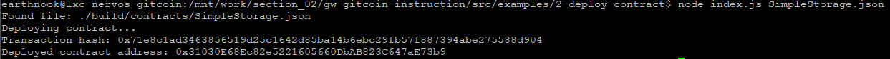

# 1. Screenshot of the console output immediately after you have successfully deployed a smart contract

# 2. Transaction hash from the contract deployment (in text format)

0x71e8c1ad3463856519d25c1642d85ba14b6ebc29fb57f887394abe275588d904

# 3. Deployed contract address from the contract deployment (in text format)

0x31030E68Ec82e5221605660DbAB823C647aE73b9