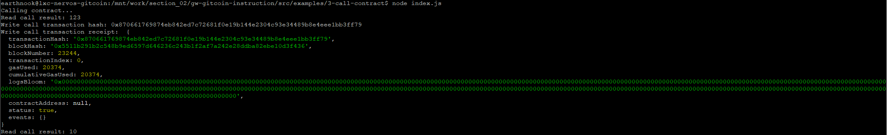

# 1. Screenshot of the console output immediately after you have successfully issued a smart contract call



# 2. Transaction hash from the console output (in text format)

0x870661769874eb842ed7c72681f0e19b144e2304c93e34489b8e4eee1bb3ff79

# 3. Contract address that you called (in text format)

0x31030E68Ec82e5221605660DbAB823C647aE73b9

# 4. ABI for contract you made a call on (in text format)

```json
[
    {
      "inputs": [],
      "stateMutability": "payable",
      "type": "constructor"
    },
    {
      "inputs": [
        {
          "internalType": "uint256",
          "name": "x",
          "type": "uint256"
        }
      ],
      "name": "set",
      "outputs": [],
      "stateMutability": "payable",
      "type": "function"
    },
    {
      "inputs": [],
      "name": "get",
      "outputs": [
        {
          "internalType": "uint256",
          "name": "",
          "type": "uint256"
        }
      ],
      "stateMutability": "view",
      "type": "function"
    }
]
```