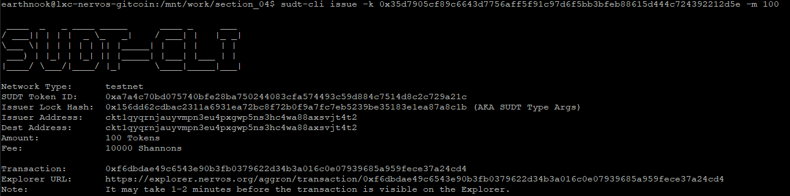
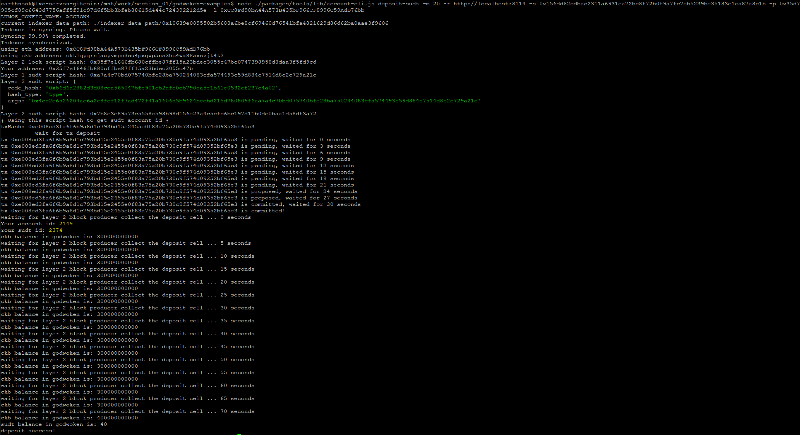

# 1. Link to the Layer 1 address you funded on the Testnet Explorer

https://explorer.nervos.org/aggron/address/ckt1qyqrnjauyvmpn3eu4pxgwp5ns3hc4wa88axsvjt4t2

# 2. Screenshot of the console output immediately after using sudt-cli to create your SUDT tokens on Layer 1

# 3. Link to the transaction ID created by sudt-cli on the Testnet Explorer

https://explorer.nervos.org/aggron/transaction/0xf6dbdae49c6543e90b3fb0379622d34b3a016c0e07939685a959fece37a24cd4

# 4. Screenshot of the console output immediately after you have successfully submitted a deposit to Layer 2 using the account-cli tool

# 5. SUDT ID from the console output after executing the deposit script (in text format)

2374