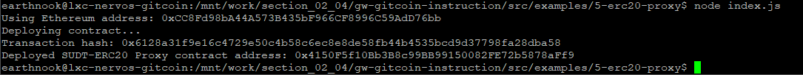
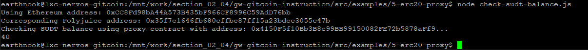
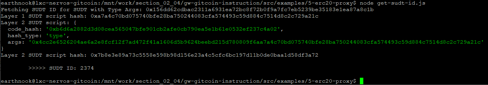

# 1. A screenshot of the console output immediately after deploying smart contract

# 2. The address of the ERC20 Proxy Contract you deployed (in text format)

0x4150F5f10Bb3B8c99BB99150082FE72b5878aFf9

# 3. A screenshot of the console output immediately after checking your SUDT balance

# 4. The Ethereum address that was checked (in text format)

0xCC8Fd98bA44A573B435bF966CF8996C59AdD76bb

# 5. Bonus

