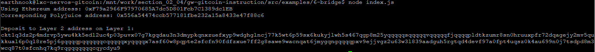
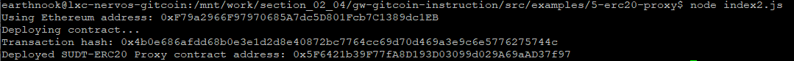
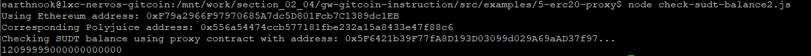

# 1. A screenshot of the console output immediately after you have successfully generated your Deposit Receiver Address

# 2. Your Deposit Receiver Address (in text format)

ckt1q3dz2p4mdrvp5ywu4kk5edl2uc4p03puvx07g7kgqdau3n3dmypkqnxzuefxyp9wdghglncj77k5wt6p59sx6kukyjlwh5s467qgp8m25yqqqqqsqqqqqvqqqqqfjqqqqpldtkzumr8sn0hruuxpfr72dqagejy2mv5qukkual6p0ql8re5pj6gqqqqpqqqqqqcqqqqqxyqqqqx7asf60w8pqpte2sfcfn90fdfzxue7ff2g8sawe9wacnqat6jmygqngqqqqpxv9ejjvgz2u63w3l839aadguh5rgtqd4devf97a0fpt4uqsz0k4au699n0j7tsdpd8m3wcq87t0sfcnhq7kq9rqgqqqqqqcqycdyu9

# 3. The Ethereum address used to generate the Deposit Receiver Address (in text format)

0xF79a2966F97970685A7dc5D801Fcb7C1389dc1EB

# 4. A link to the Etherscan explorer for the successful Force Bridge transaction. This can be found on Force Bridge under History→Succeed

https://rinkeby.etherscan.io/tx/0xbfc2c958e9579478efb09c2e9724828ccafa5cbaa578e291f21bf05bd6ffd392

# 5. A link to the Nervos explorer for the successful Force bridge transaction. This can be found on Force Bridge under History→Succeed

https://explorer.nervos.org/aggron/transaction/0x2869dc5a4dd2c317abf3ba600e7ad42667fdc1d70ed8f683c567a0533f031eda

# Bonus

